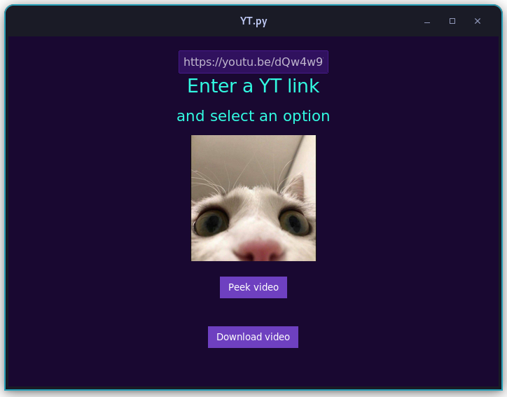

# yt.py
 YT Downloader

## Installation of the YT.py Project

This project is a YouTube video downloader application in Python that uses the PyTube library. To get started with YT.py, follow the installation steps below.

### Prerequisites

Before installing the project, ensure you have Python installed on your system. You can download Python from [python.org](https://www.python.org/downloads/).

### Installation Steps

**You can download for windows without python [here](https://github.com/milosnowcat/yt.py/releases/latest)!**


1. Clone the GitHub repository to your local machine using the following command:

   ```bash
   git clone https://github.com/milosnowcat/yt.py.git
   ```

2. Navigate to the project directory:

   ```bash
   cd yt.py
   ```

3. Install the required dependencies using pip:

   ```bash
   pip install -r requirements.txt
   ```

That's it! You have successfully cloned the YT.py project and installed the required dependencies.

---

## Using the YT.py Project

YT.py is a YouTube video downloader application in Python. Follow these steps to use the application to peek at YouTube video information and download videos.

### User Interface

The user interface allows you to enter a YouTube video URL, view video information, and download videos.



### Peeking at Video Information

1. Open a terminal or command prompt and navigate to the directory where you cloned the YT.py project.

2. Run the application by executing the Python script:

   ```bash
   python main.py
   ```

3. The application will open a graphical user interface (GUI) displaying a text input field to enter a YouTube video URL.

4. Enter a YouTube video URL in the input field (e.g., "https://youtu.be/dQw4w9WgXcQ").

5. Click the "Peek video" button to retrieve and display information about the video, including its title and author. The video's thumbnail will also be displayed.

### Downloading a Video

1. After peeking at the video information, click the "Download video" button to download the highest resolution version of the video.

2. The video will be downloaded and saved as an MP4 file in the project directory.

3. A message indicating that the video has been downloaded will be printed in the terminal.

### Exiting the Application

To exit the application, simply close the application window by clicking the close button (X) in the top-right corner of the window.

Enjoy using the YT.py YouTube video downloader application!
